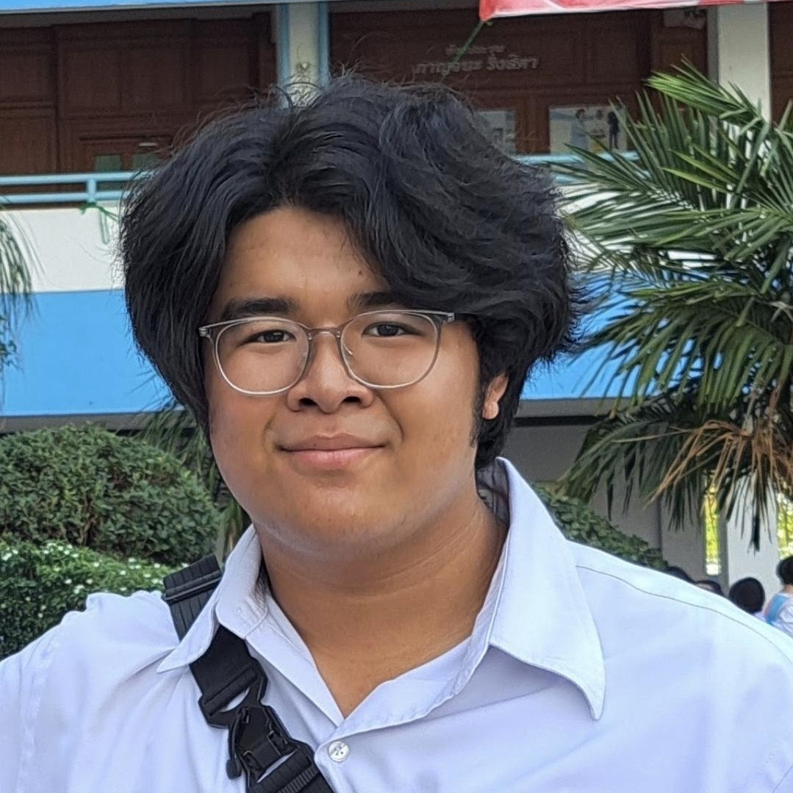
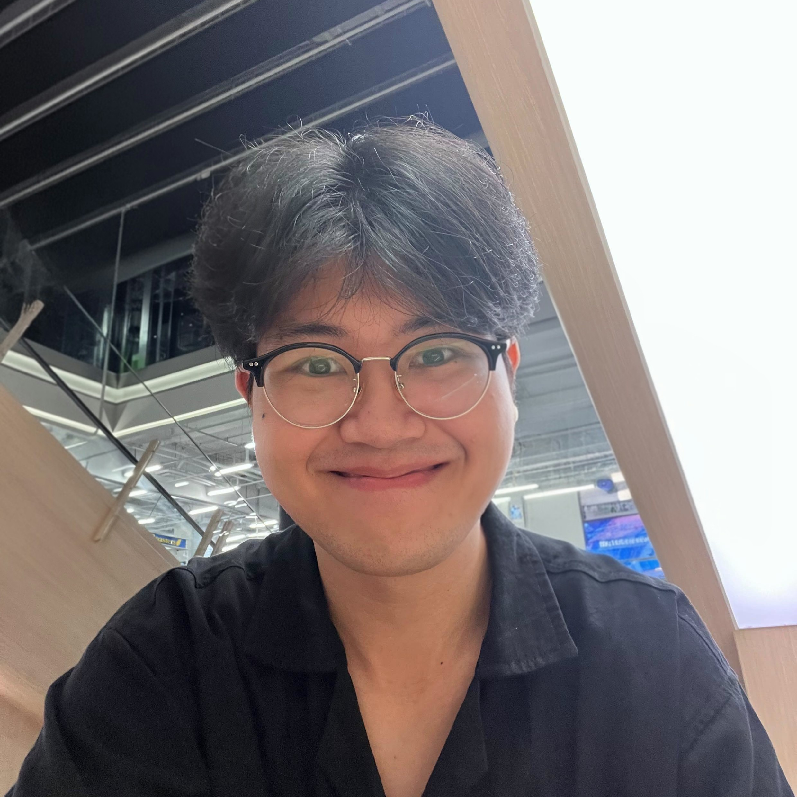

# Physical Computing Project 2026 - IT KMITL | SPYNE

> **Disclaimer:** This project was developed as an educational project for the Physical Computing course at the School of Information Technology, KMITL. It is not for commercial use, production deployment, or sale.

## Objectives

เพื่อตรวจจับและจำแนกท่าทางการนั่งทำงาน โดยใช้ Ultrasonic Sensor 2 ระดับ (ระดับสายตาและระดับหน้าอก) ที่ติดตั้งบริเวณหน้าจอคอมพิวเตอร์ โดยออกแบบให้จำแนกท่าทางการนั่งได้ 6 รูปแบบ (นั่งตรง, ใกล้เกินไป, ไกลเกินไป, คอยื่น, ตัวไถล, และไม่ได้นั่ง) โดยไม่ต้องพึ่งพากล้อง

เพื่อแก้ไขท่านั่งของผู้ใช้ เมื่อตรวจพบพฤติกรรมการนั่งที่ผิดสรีระศาสตร์ติดต่อกันเกินเวลาที่กำหนด จะแจ้งเตือนผู้ใช้งาน ช่วยให้ผู้ใช้งานสามารถปรับเปลี่ยนท่าทางได้ทันที

## Overview

Project ต้องการแก้ปัญหานั่งทำงานไม่ถูกท่า ซึ่งส่งผลต่อกระดูกสันหลังและสุขภาพในระยะยาว จากผลสำรวจในปี 1990 ถึง 2015 พบอัตราการเพิ่มขึ้นของผู้ที่มีอาการปวดหลังสูงขึ้นถึง 54% Project นี้จึงมีประโยชน์ต่อนักเรียน, นักศึกษา, และวัยทำงานที่ใช้งานคอมพิวเตอร์เป็นเวลานาน โดยใช้ Ultrasonic Sensor ตัวแรกระดับสายตาบริเวณเหนือหน้าจอในการวัดระยะห่างจากตาถึงหน้าจอ และตัวที่สองอยู่บริเวณใต้หน้าจอในระดับหน้าอก เพื่อการจำแนกท่านั่ง (นั่งตรง/ใกล้เกิน/ไกลเกิน/คอยื่นไปข้างหน้า/ตัวไถล/ไม่ได้นั่ง) โดยมี

<code>Input: ข้อมูลจาก Ultrasonic Sensor และผู้ใช้งานกำหนดค่า</code>  
<code>Output: สถานะท่านั่ง, การแจ้งเตือนผ่าน RGB LED, LCD, และ Buzzer, และข้อมูลย้อนหลังผ่าน Arduino Cloud</code>  

#### Hardware

- Arduino UNO R4 WiFi 
- RGB LED (Tri-color LED) 
- HC-SR04 Ultrasonic Sensor ×2 
- Active Buzzer
- LCD 16×2 with I2C Module
- Breadboard, Jumper Wires, และ Resistors

#### ตำแหน่งของ Sensor

- Eye-level Sensor: ติดตั้งบริเวณขอบบนของหน้าจอคอมพิวเตอร์ ทำมุมเล็งมาที่ใบหน้าหรือคาง เพื่อตรวจจับระยะห่างสายตาและหน้าจอ
- Chest-level Sensor: ติดตั้งบริเวณฐานหน้าจอหรือระดับโต๊ะ ทำมุมเล็งมาที่หน้าอกหรือกระดูกสันหลังส่วนบน เพื่อตรวจจับตำแหน่งลำตัวหลักและการไถลตัว

#### การจำแนกท่าทาง

| State					| Eye-level Sensor	| Chest-level Sensor	|
|---------------|-------------------|---------------------|
| Upright				| normal						| normal							|
| Too Close			| closer						| closer							|
| Too Far				| farther						| farther							|
| Forward Head	| closer						| normal							|
| Slide/Slouch	| not detected			| closer							|
| Not Seated		| not detected			| not detected				|

## Contributors

| ID        | Name                  	| Img                                                        |
|-----------|-------------------------|------------------------------------------------------------|
| 68070002  | นายกฤตชัย ถาวรพันธุ์ (เก้า) 	|   |
| 68070029  | นายชินดนัย เรืองสมบัติ (อู๋)   |   |
| 68070057  | นายธนดล กระจ่างโรจน์ (ฟิวส์) |   |
